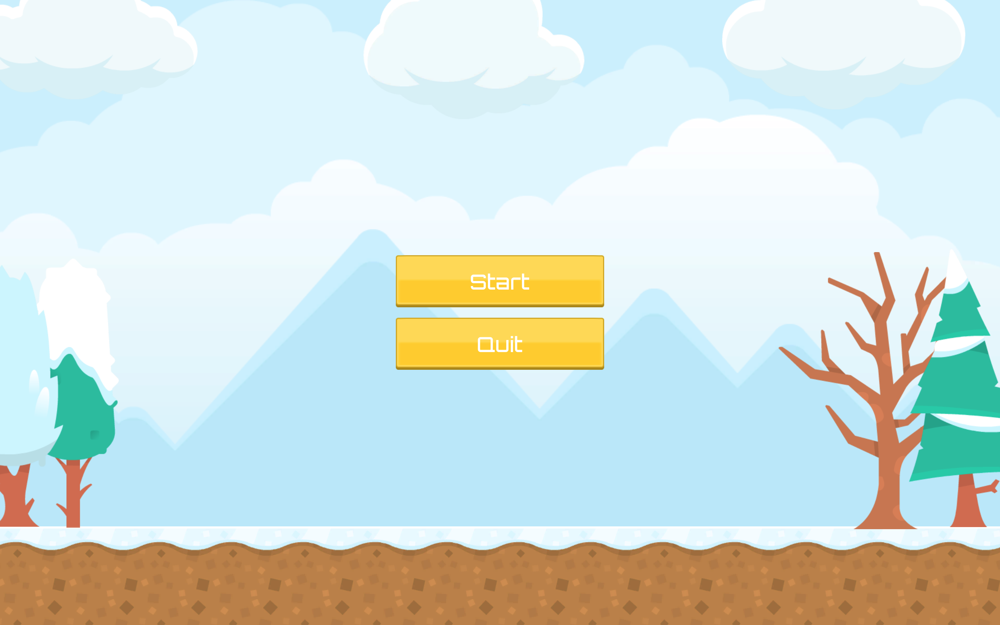
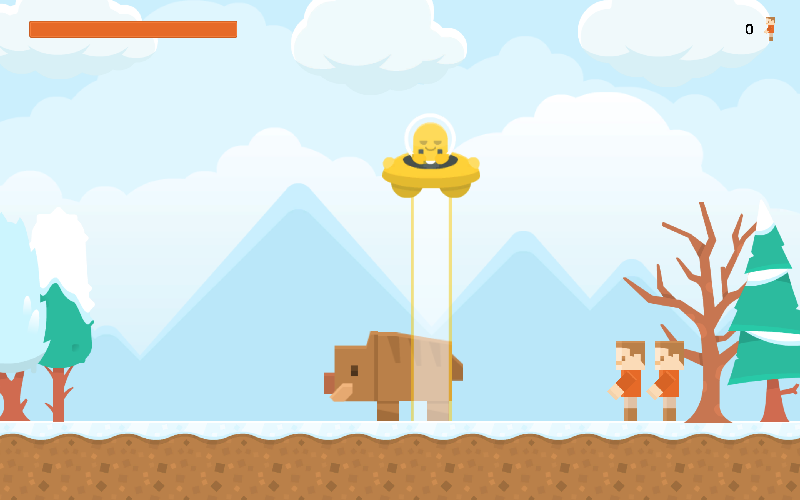

# Alien Runner 2D
Alien Runner is a simple 2D-game developed with Unity. The player controls an alien spaceship with his mouse along the x-axis. Goal of the game is to "abduct" as many Humans as possible! Mammoths are your fuel.

**Important:** this project is a student project, it's not meant to be performant.

## Progress
100% done.

# Releases
You'll find the current release (v1.0.1) under [releases](https://github.com/NotMyTschopp/AlienRunner-vTschopp/releases).

## Known bugs, issues and limitations
It may is possible that if a mammoth is destroyed and the mouse button is released at the same time, that the fuel gauge will not be updated until the mouse button is held again.

## Development and target platforms
* Unity 2018.2.14f1 on macOS Mojave
  * Scripting Runtime: .NET 3.5
  * API-Level: .NET 2.0 Subset
* Visual Studio for Mac 2017 v7.7.2
* Built for standalone desktop (1920x1080) - currently macOS only!

## How to build from source?
Just clone the repo, jump into Unity (2018.2.14f1) and punch the build button.

## Resources
* [Orbitron (Font)](https://fonts.google.com/specimen/Orbitron)
* Sprites and images by [Kenney Vleugels](https://www.kenney.nl)
  * [Alien UFO Pack](https://www.kenney.nl/assets/alien-ufo-pack)
  * [Background Elements Redux](https://www.kenney.nl/assets/background-elements-redux)
  * [UI pack](https://www.kenney.nl/assets/ui-pack)
  * [Voxel pack (base)](https://www.kenney.nl/assets/voxel-pack)

## Screenshots

* You'll find the concept in [Screenshots](./Screenshots/alien-runner_concept.jpg).
* You'll find a gameplay video in [Videos](./Videos/).

# Lessons learned
* How to use scriptable objects
* How to use sprites and how to slice them
* Patience... a lot of patience...

## License
This project is licensed under the BSD 2-Clause License - see the [LICENSE.md](LICENSE.md) file for more information.